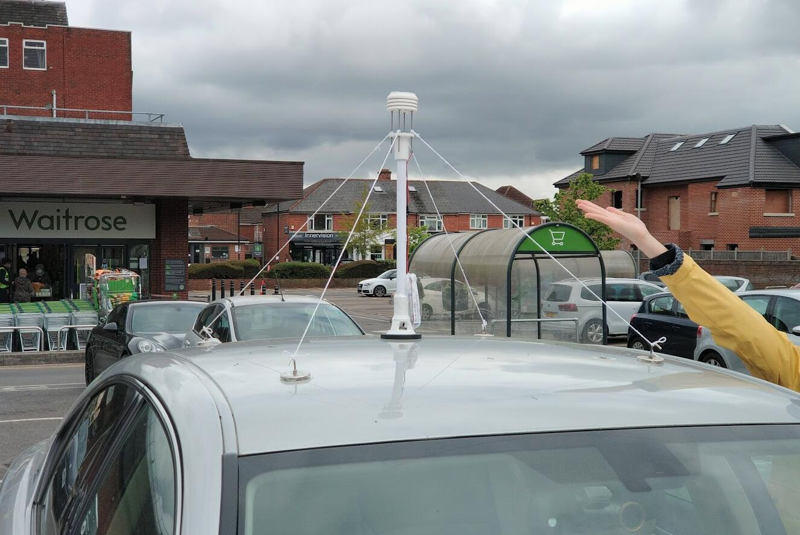

# QingStation 青站
 

A compact weather station.

## About this project
The goal is to build a small and versatile weather stations.
But before introducing this project, I shall mention my other project **DeepPlankter**.
DeepPlankter is a tiny autonomous water drone ship that could sail in the ocean for months using wave-propelled underwater wings.
Sailing alone is fun though, if we can collect some meaningful data during the sailing will be even more exciting. 

Thus, a weather station is perfect to fit this purpose! 
Imagine that the ship is measuring wind velocity on a 10 metres high wave at the centre of a storm. 
So challenging.

There are some goals of the weather station:

- Low-power

The electronics on the ship is supplied by solar panels so is the weather station. 
The solar panels have a peak power rating of `10W`, or `40Wh` in a sunny summer day.
However, this `10W` will need to supply the main controller, GPS, satellite, rudder servos, and charge batteries for over-nights supplies.

A rough estimation is `<100mA` average current for the whole ship. 
The weather station should have a maximum `10mA` average current. 

- Small & lightweight

The drone is small, with a deck width of only `~12cm`. 
Ideally, the dimensions of the weather station should be less than the width of the deck. 
When installing it on the ship, it should be placed as high as possible. 
Elevating a large mass on the mast decreases the stability of the ship. 

- Versatile

While keeping it small, implement as many digital sensors as possible.
There are 2 DIY analogue sensors, the ultrasonic anemometer and infrared rain sensor onboard. 

## Repositories
- Hardware: please see [the PCB folder](PCB) in the[main repo](https://github.com/majianjia/QingStation)
- Firmware: [QingStation-Firmware](https://github.com/majianjia/QingStation-Firmware)
- Bootloader: [QingStation-Bootloader](https://github.com/majianjia/QingStation-bootloader)

## Building logs

There are some very detailed post that recall the development:
- [Assembly](doc/assembly.md)
- [Ultrasonic Anemometer](doc/anemometer.md)
- [Optical rain sensor](doc/rain_sensor.md)
- [OTA firmware update](doc/ota.md)

## Features and functions

For the hardware V1.1

**Features**: 
- MCU: STM32L476
- PCB dimension: Φ48 mm
- SDCard
- RTC

**Sensor Integration**:
- Anemometer (2x2 Ultrasonic transducer array `40k/200kHz`)
- Rain sensor (IR Optical type)
- Lighting sensor (AS3935) 
- IMU & eCampass (BMX160)
- RGBI light sensor (APDS-9250)
- Microphone (MP34DT05/6)
- Barometer, humidity, temperature sensor (BME280)

**Communication Interfaces**:
- 2x UART
- I2C
- SPI
- CAN (FDCAN)
- USB (CDC and/or MassStorage)

**Power Consumption**
- Normal 20~22mA
- Normal + GNSS: ~45mA
- Normal + GNSS + ESP8266(MQTT @ 1Hz): ~100mA
- Sleep: unknown 

**External Communication**
- ESP8266 (AT)
- ESP32 (AT)
- SIM800c

### Functions description

Digital sensors are used whenever it is available. 
Today's digital sensors are easy to use as long as they are connected to I2C correctly.
The onboard sensors were all up in a day. 

#### Digital sensor

For the lighting sensor (AS3935), I could not make an easy test to validate my antenna design. 

For the RGBIR sensor, we cannot calibrate the sensor using a cosine corrector which light sensor usually used. 
I have no tools that can calibrate this sensor. 
RGBI sensor can provide colour data than a single lumen meter. 

IMU and eCampass are not needed for a stationary mounted weather station. 
But in sailing, its high mounted location is perfect for navigation where fewer inferences than in the hull (the ship's main controller). 

An additional small size GPS module can be connected to one of the UART, 
to provide clock calibration even we do not the location in stationary mount. 
It is much helpful when sailing, to provide a secondary GPS location.

The microphone can measure the noise level if calibrated. When on the ship, it can record the sound of the ocean.
A very interesting application is to use TinyML for sound recognition applications, 
such as Speech Command Spotting, bird finding... or detecting illegal logging in a forest. 
I will train and use NNoM to deploy a neural network model for speech command, to control the functions. 

#### Analog sensor
The rain sensor is consist of a pair of an IR transmitter and a receiver. 
The method is to use the reflection of a piece of trapezoid glass (hand made..). 
When droplets land on the surfaces of glass, it will reduce the reflection, therefore the signal magnitude on the receiver will change.
We can either use calibrated absolute value or use the covariance. 
This sensor will not be accurate. Even when on the sea, droplets from large waves can easily keep the sensor wet all the time.  

Anemometer is the most difficult sensor but also the most challenging sensor. 
The anemometer uses a reflection of the ultrasonic beam to measure the speed of air in 2 horizontal direction..ideally.
The reality is much complicated, it well worth a separated document. 
A [good project](https://www.dl1glh.de/ultrasonic-anemometer.html#advancement) by Hardy Lau mentioned most of the principle and information.  

### Configuration methods

There are many ways to configure or communicate to QingStation, but none of them is wireless. 
So we probably cannot just connect to a smartphone App to control it unless I a wireless module is connected to one of the ports.
However, I have implement USB CDC device, which works well in Android phone as a serial ports. 

The methods I intended to use are:
- A configuration file (JSON) in SDCard - implemented.
- USB port (A virtual UART device, also known as CDC) - future;
- LPUART1 (act as AT Server for configuration) - future;

Currently, the JSON method is the primary method. Because it is easy to use and the settings are obvious. 
Plugging a empty SD card, QingStation will write a default configuration file called `config.json`.
Unplug sd card and revise it using any text editor. The new configuration will be reload on the next system power up. 

USB port and UART require the PC to have a terminal or some tools that can talk through a serial port. 
AT CMD is ok to use but setting are not easily done by a human. 

For the LPUART, I plan to make it dedicated to AT server or client. 
When it is used as AT server, the QingStation can be configured by Arduino or other user boards and provide data for them. 
When it is used as AT Client, it can control other devices to send data directly to server, such as BLE modules, LoRA, or GPRS/4G. 
RT-Thread already support common AT hardware, including SIM800C.
With RT-Thread's rich supports for IoT software packages, it is straight forward to implement Internet, MQTT and others. 

# Author & Copy Right
All materials under this repository is licensed under *CC* BY-NC *4.0 License*  
Please contact the author if you have any request.

Jianjia Ma 

`majianjia(*at*)live.com`

