# Ultrasonic Anemometer Design and Practice

This documentation is dedicated to the design and tuning of the ultrasonic anemometer. 

# Introduction
Anemometer is the most interesting sensor on QingStation. 
However, it is also very challenging for me since I got almost no experience in analog circuit design, 
while anemometer requires both analog amplifier and heavy data processing. 
(I don't even know how to use an operational amplifier at the beginning).

A very good blog I learnt from time to time is the [Anemometer by Hardy Lau](https://www.dl1glh.de/ultrasonic-anemometer.html#advancement). 
This blog is very informative and already cover most of the knowledge needed to build your own ultrasonic anemometer. 

The principle in short: when ultrasonic waves (pules) propagate in a flowing medium(air), the time that the waves reach the destination will be different.
The time difference in forward and backward propagation is reflecting the speed of the medium flow, i.e. the wind speed. 
With 2 pairs of transducer placed perpendicular to each pair, the wind direction can also be calculated by using simple trigonometry.

The advantage of ultrasonic anemometer compared to other types:
- Ultrasonic anemometer is small compared to spinning type (cup anemometer).
- Reasonable difficulty and cheap to DIY, also a good instruction available by Hardy. 
- It has NO MOVING PARTS! Moving parts are not very easy to DIY especially when waterproofing. 

# Methods

## Basic principle

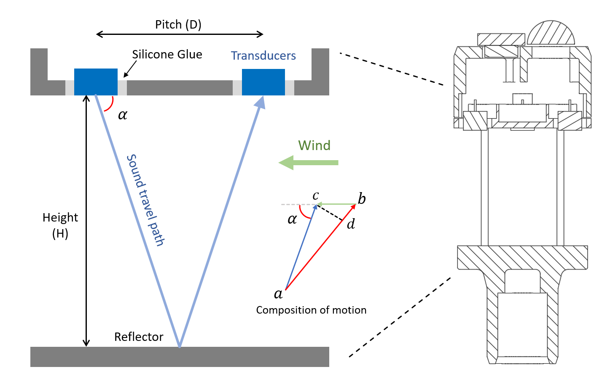

The principle is very simple, the sound wave that propagates in a medium (air) is affected by the movement of the medium. 
By using the known propagating path and the time of propagation, we can calculate the speed of the medium. 

In the above graph, we can see the travel of wind *BC* added to the sound propagation *AB* result in the travel path *AC*.

[Lau](https://www.dl1glh.de/ultrasonic-anemometer.html#advancement) 
has posted all related equations (with different notation). 

In C language:
~~~
alpha = atan(2*H/D);
v = H/sin(alpha)*cos(alpha)*(1/t1 - 1/t2);// wind speed
c = H/sin(alpha)*(1/t1 + 1/t2);           // sound speed
~~~

To measure the wind direction, use `arctan2` on 2 perpendicular pairs.  
~~~
beta = atan2(NS, EW);  // north->south, east->west
~~~

## Practical issues, solution and compromise
In reality, things normally don't work as we want, especially with analog circuits. 

### Mechanical design 
#### Design

I use [Fusion 360](https://www.autodesk.com/products/fusion-360/overview) to design the hardware and use my old crappy 3D printer to build them. 

The transducers are placed at the top side and facing down. 
The reflective plate just a flat surfaces. 
Electronics and other sensors are located above the transducer in a shielded box. 

I even managed to make an air flow simulation using [Simscale](https://www.simscale.com/).
The airflow speed is set to `30m/s` equivalent to `~58knots`, near a centre of a storm. 

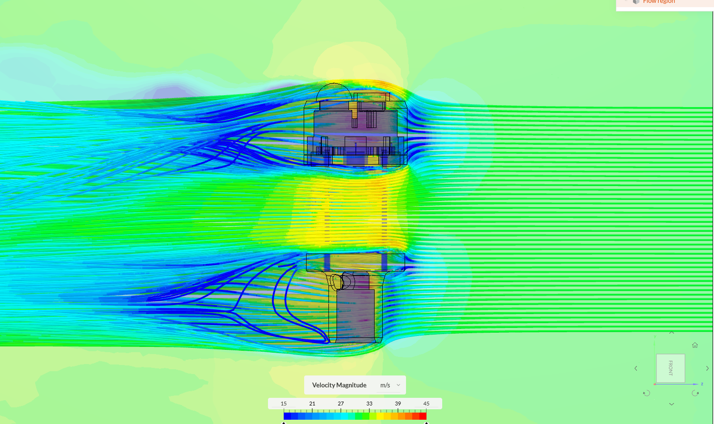

As you can see, the airflow in between the top and the reflective plate is actually accelerated by `~3m/s`. 
No idea if we need to take them into account in later processing.  
I don't have any access to a wind tunnel, so I could not do a test in a perfect experiment environment. 

#### Sound path

As shown in the introduction, the sound beam should travel along the noted path. 
But the reality is a different story.
- There is a direct sound propagate directly to the receiver transducer. 
- These sounds waves will mix together. 
- The 3D printed plastic is rigid and lightweight, perfect for amplifying a sound. The reflector might also be a speaker.  

The light-weight plastic is not a problem in Lau's works because his anemometer is based on a metal frame. 

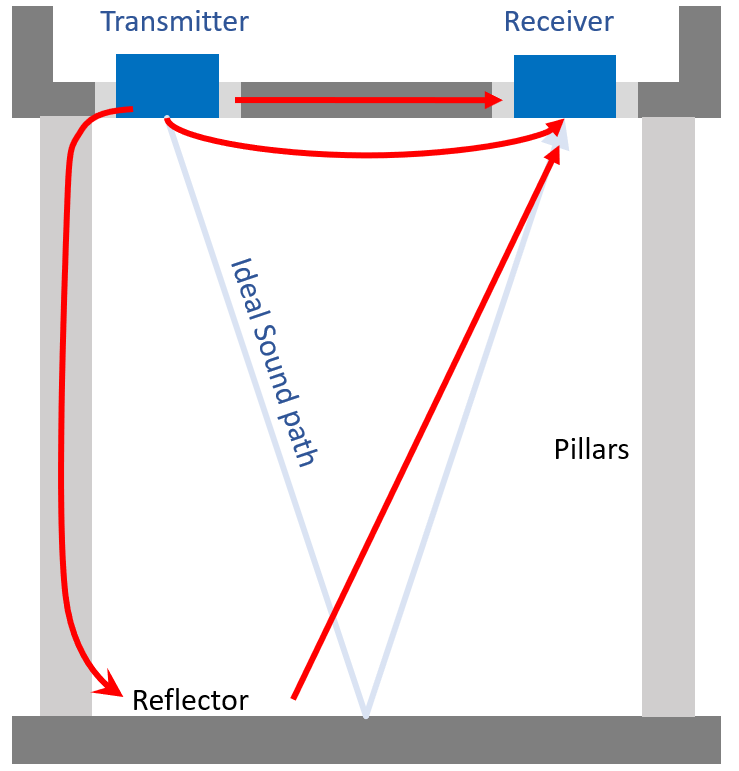

These sound beams can be seen in the receiving signals. 
Adding some coins as a counterweight might help to reduce the magnitude of the other beams. 

### Ultrasonic transducer, driver 

Here is the schematic of the second version(PCB v1.1), details will be explained in the following sections.
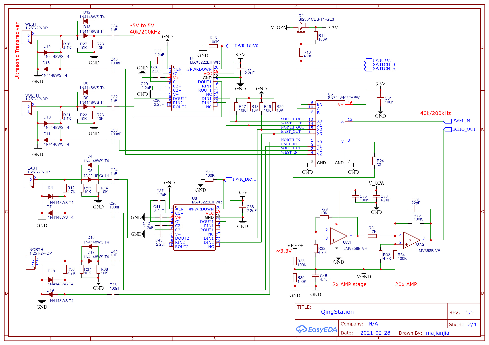

A low-voltage 4052 analog switch controls which channel is selected as output and which is listening to the echo. 
Excitations are generated by a timer's PWM channel, while the echo output is amplified by op amps and measured by ADC. 

#### Transducers
I brought a few different parts from taobao for testing, they are:
- A `40kHz` `10mm` waterproof(P/N: EU10AIF40H07T/R) 
- A `200kHz` `10mm` waterproof(P/N: EU10PIF200H07T/R)
- A `40kHz` `16mm` waterproof (P/N: NU40A16TR-1)
- A few HC-SR04 type open-end transducer. None-waterproof. 

The first three with part number have similar parameters as below. 

- Sound pressure `10V(0dB=0.02mPa) ≥106dB`
- Receive sensitive at `40KHz (0dB=V/ubar)：≥-75dB`
- Capacitive are all at a few `nF` depended on their diameter. 

I did not test the HC-SR04 because they are much larger than the `10mm` ones. 

The final decision is the first one, `40kHz 10mm` waterproof transducer(P/N: EU10AIF40H07T/R).
The size of it is small, which helps to reduce the overall assembly size. 
It is inexpensive compared to the `200kHz` version (4 times the cost). 
High frequency can bring shorter pulses but those `40kHz` already good enough. 
It has a wide-spreading directivity(less than `-3dB @ 30degree`), which means that I don't need to fix it at an angle to the plate as Lau did.
Everything laying down flat simplifies the mechanical design and assembly process.

About frequency selection:
> Ideally, the pulses should as short as possible.
> We normally send `3~4` pulses.
>
> `f=40k, λ=8.4mm` pulse width `33mm` 
> 
> `f=200k, λ=1.68mm` pulse width `6.72mm` 
>
> Both are smaller than the Height (`5cm`). 
> Shorter wavelength always better, however, the signal also degrade faster through propagation.
> Also, higher frequencies have different requirements on the materials of the reflective plate. 

The only concern left is whether the signal pules is short enough 
to avoid mix signal between the direct sound (we don't want) and reflective sound, i.e. echo (we need). 

I didn't consider the muRata `MA40E8-2` which was used in Lau's blog because the production was discontinued and it was more expensive anyway. 

#### Driver design
Driver design is a tricky part. A lot of pains here. 

For size and low-power consideration, I did not use a conventional MOSFET driver + transformer to drive the transducer. 
Instead, like the old-style HC-SR04, I decided to use RS-232 interface drivers (such as MAX3232) to generate RS-232 levels 
(`-5.5V` for `1` and `+5.5V` for `0`) square wave. 
It should more or less provide at least `10Vpp` signal to drive the transducer. 
Those 3V variances run on a 3V power supply so all the ICs and sensors can run on the single power rail. 

These RS-232 chips have many alternatives, the driving capability is good enough for the transducers (a few `kohm` and a `few nF` in parallel). 
The one used here is MAX3222, it provides a shutdown pin that can save power compared to more often used MAX3232. 
These chips are low-cost and packed in a small MSOP package. 

However, these chips introduced a huge interference issue from the driver side.

The MAX3222 drive the transducer through a `1uF` capacitor from one of its output channel. 
On the receiver (transducer) side, a set of clamp diodes to the ground and resistors should ensure the signal won't travel back to the driver side. 
Also, another set of clamp diodes place in serial to the driver capacitor should block any noise that comes from the MAX3232. But it doesn't.

Because the MAX3232/3222 are generating negative and positive driving voltage based on the charge pump method, 
it is impossible to get a smooth output voltage but can only decrease the frequency of switching by increasing those capacitors. 

The signal on the driving capacitor looks like this:

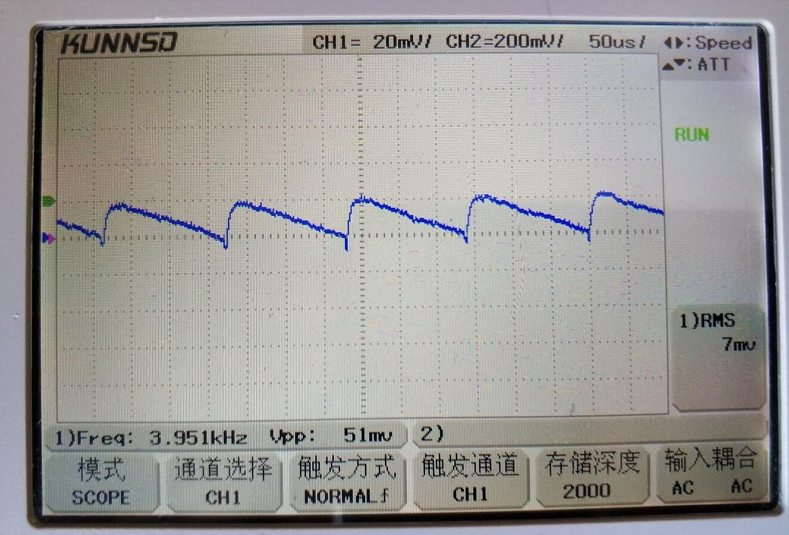

Although after the clamp diodes, the noise is "negligible" even my oscilloscope cannot detect, but some things still pass there. 
Which results in a distortion of the receiving wave.  

Here is the wave without connecting transducer, when connected, the noise will be lower but still exist. 
The same channel means the driver (MAX3232) connected directly to the receiver. 
Cross channel means from the other MAX3232 by power or other unknown sources.
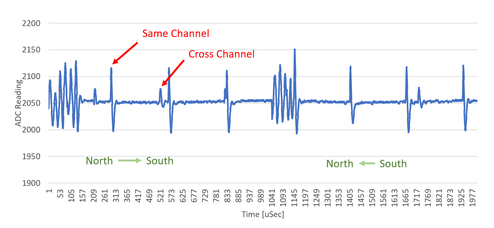

The below image shows an actual signal distorted by the noise from the driver side. 
The cross channel distortion is negligible, but the same channel distortion definitely affects the shape of the echo beam. 
Notice that the signal shown here was collect before I glue the transducer to the frame so that the signal here have a larger amplitude.
When the transducers were glue to the frame, the distortion effect increased while the signal amplitude decreased.
This will leads to some trouble in measuring the arrival time.  

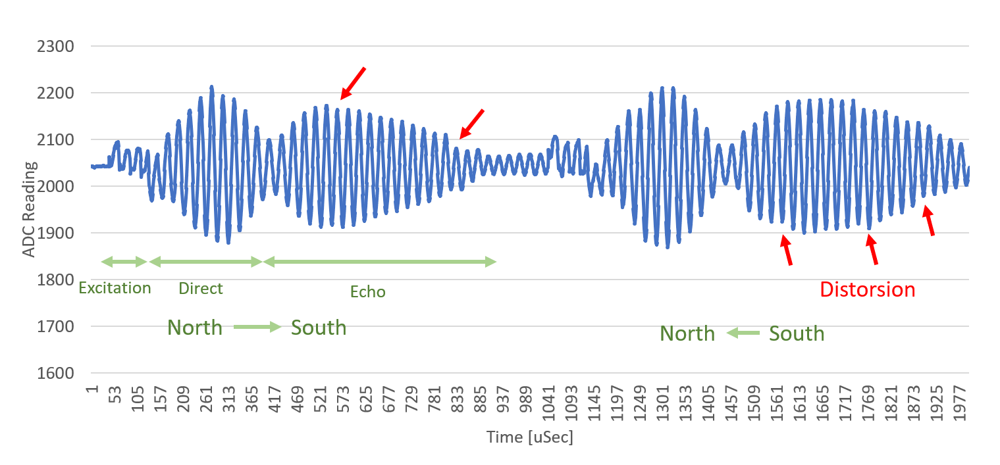

I tried many methods including adding capacity to the MAX3232 charge-pump capacitors. 
This helps to reduce the ripple frequency from `6.6kHz` to `~3kHz` but very little effect on reducing the amplitude of the ripple. 

Later I found the trigger of the charging pump is very simple, once the voltage reaches a recharge threshold, it switches.
Very much like a DC/DC converter with PDM mode, low-power, but higher noise. This kind of noise cannot be eliminated.

In the first PCB (v1.0), I cannot eliminate this noise with MAX3232 because both MAX3232's powers are controlled by a single P-MOS.
I could not switch off one while still powering the other to drive the transducer. 
So I designed a second PCB (v1.1) using MAX3222, which can be placed into a shutdown mode thus to stop the charge-pump,
while the channel is listening for the echo. 
Hopefully, it can eliminate the issues. 

### Echo signal and amplifier

(I rarely touch analog circuit since forever, this definitely does not help with the designing and debugging)

When a transducer receives an echo, it generates a voltage between the two electrodes.  
The signal first passes through a `4.7k` resistor then a `100nF` capacitor to block the DC signal. 
Then, it passes through an analog switch (4052, Low Voltage version), before it finally reaches the amplifier. 

Since we use a single rail power supply, the 4052 does not allow a negative voltage signal to pass.
Instead, we will charge each channel's `100nF` capacitor to the virtual ground (`1/2 Vreff`) 
before we start to send the pulses and collect measurement. 
A small waiting, `5ms`, is needed when the channel switched for charging for stabilizing the voltage of the `100nF` cap.

#### Amplifiers

For the amplifier, I use the most common LMV358 dual op amp. 

In PCB v1.0, only a single-stage amplifier is used to amplify the echo, 
while the other one is used for generating a low impedance virtual ground. 

The op amp was only set to `10x`, which I cannot even see the signal in my ADC data. 
I overestimated the signal strength.
I tried to change the gain to `~200x` for a clearer signal. 
However, the signal reading ranges is still too small (around `100 digits/pp` in a `12bit`, `4096` ADC). 

Later, until I accidentally saw a tutorial on YouTube [Basics of Op Amp Gain Bandwidth Product and Slew Rate Limit](https://youtu.be/UooUGC7tNRg)
then I realized what was wrong here. The bandwidth of LMV358 (as well as all other op amps) list in the datasheet is "Unit Gain" also equal to "Gain–Bandwidth Product" 
which does not cover the full frequency range. 
LMV358 will only have around maximum `1MHz/40kHz = 25x` gain no matter how much I set.  
What makes things worst is I added a `22pF` capacitor to the feedback loop for an RC filter which also decreases the gain. 
The `22pF` is equal to `180kOhm` at `40kHz`. 
Now I know why I could not see a signal at the beginning, the final bandwidth is too small filtered out all signals. 

Unfortunately, by the time I learnt the GBP parameter, PCB V1.1 fabrication and assembly are already finished and on their long way to me. 
In PCB v1.1, the 2 op amps are all used to amplify the echo. 
The first stage was set to low input impedance, to help the signal to stable quicker when channel switch (charge the capacitor). 
The 2 stages op amps also allow higher total gains while still let the `40KHz` signal pass. 
The `22pF` was placed on the second stage op amp, which will need to desolder when the boards arrive.  
The virtual ground is now provided by a voltage divider and a large capacitor. 
The new circuit looks good at least in the simulation. 
However, in this circuit, we still cannot test the `200KHz` transducer, 
unless I change to a high bandwidth op amp and drop plenty of the LMV358 that I brought earlier.

#### The noise from the driver

I think the small capacitor in the clamp diodes let the driver's noise passed to the receiver side. 
This is also approved in a simulation circuit built using EasyEDA.
With clean power, I can still see a small amplitude noise pass through. 
The 1N4148 cannot block the noise from the driver side completely. 
Hopefully, this will be fixed in PCB v1.1, where I changed the MAX3232 to MAX3222 to stop the charge pump. 

#### PCB v1.1 Updates

As for PCB v1.1, the above problem are eliminated by turning off the receiver side driver. The measurement is lying stably within a few digits during sampling. 

### Signal processing

*The code for signal processing can be found in the dedicated firmware repository.*

#### ADC setting 

STM32L476's ADC is very powerful, can reach `5Msps` sample rate.
Here I set the sample rate to `1MHz`. I did not configure it to higher because it is not necessary:

- LMV358 only have `1MHz` GBP.
- Event `5Msps` does not bring significant improvement in resolution. 
- Sub resolution accuracy can be achieved by linear interpolation (details in signal processing section). 

At each burst, the ADC samples for `1ms`, which collects exactly `1000` samples. A DMA is used to unload the CPU.
As well as to ensure the sampling moment are not affected by other tasks.  
It is enough for Height in the range of `4cm` to `10cm`.

When does the first echo arrive, and how long does the ADC need to sample?
> Assume that Height(H)=`5cm`, Pitch(D)=`4cm`, Sound speed(C)=`336m/s`
>
> The distance that the sound travel is `S = sqrt((D/2)^2 + H^2) * 2 = 10.7cm`. 
>
> The first pulse arrives at around `t = 0.107 / 336 = 318us` after pulses sent when the wind is calm. 
> Even when H=`10cm` t=`588us`. `1000` samples is more than enough.

The resolution of ADC is set to `12bit`, the maximum raw resolution without any hardware oversampling. 

To ensure the time between pulses sent and ADC start is constant,
all CPU interrupts are halted using RT-Thread's API between the start of excitation and the start of ADC sampling. 

#### Signal preprocessing

The signal output from the amplifier stage has been biased to `1/2 Vreff`, where Vreff is equal to MCU's Vdd `3.3V`.
So when there is no signal, the signal output should sit around `4095/2 = 2047.5`.

In the preprocessing stage, 
- ADC samples are brought back to zero and converted to floating-point. 
- A bandpass filter. 
- Finally normalized to the maximum at `1`.

Later I found out a digital bandpass filter can effectively reduce inference that causes by environmental inferences. 
So I came back and add a digital filter to smooth out the signal. It helps to reduce the number of detecting faulty peaks.  
A bandpass Butterworth is used here, with `2` bandwidths, `2kHz` or `10kHz` around `40kHz` carrier frequency. 

The below image shows the `10` kHz BW filter passbands. 
Any order over `4th` is already unstable with signal-precision float calculation. (The coefficients are converted to float32)
A `1st` order `10kHz` BW is used here for maximum stability. 

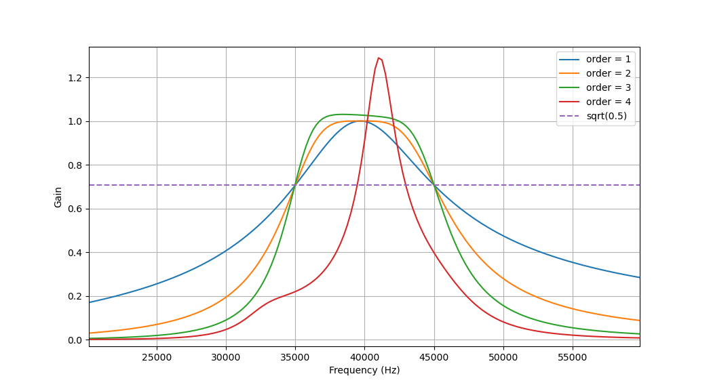

The current filter is IIR type, which I don't really like to use here as the phase delay is playing a very important role in wind speed calculation.
Let's see if we need to replace it with an FIR filter, which has a constant phase delay across all frequencies. 

#### Echo pulse

In a non-coded excitation, the echo pulse is much longer than the excitation.

Here is the first echo recorded by my oscilloscope. The excitation length is `4` pulses. 

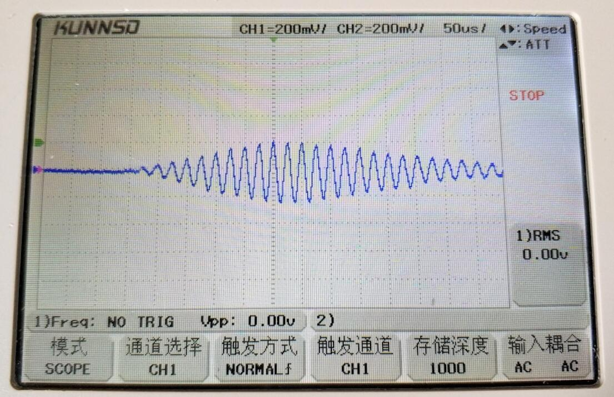

You can see that there are plenty of pulses instead of `4` which we sent. 
The envelope of the echo is a very beautiful diamond shape. We can use the shape to measure a rough propagating time. 
Or we can simply use the maximum magnitude to measure it if the signal is not distorted as mentioned in driver sections. 

In the practice, I tried a few different excitations, including barker-codes as suggested by Lau. 
~~~
    // single rate (40k)
    //uint16_t pulse[] = {50, 50, 50, 50};

    // Double rate (80k), to control the +1 or −1 phase
    // this is a bit tricky -- this is the only way to make it work.
    // STM32's timer seems to require the first cycle not to be 100% width.
    // So there is a dummy 'L' in each pulse, as well as a dummy 'L' in each end if the end is not L.
    // A +1 is 'H, L'.  A -1 is 'L, H'
    //uint16_t pulse[] = {L, H, L, H, L, H, L, H, L}; // normal -> ++++
    //uint16_t pulse[] = {L, H, L, H, L, H, L, L, H, L, H, L}; // normal suppressed -> +++--
    uint16_t pulse[] = {L, H, L, H, L, H, L, L, H, L, H, L, H, L}; // extended suppressed -> +++---
    //uint16_t pulse[] = {L, H, L, H, L, H, L, H, L, L, H, L, H, L}; // normal suppressed 2 -> ++++--
    //uint16_t pulse[] = {L, H, L, H, L, L, H, H, L}; // barker-code 4.1 -> ++-+
    //uint16_t pulse[] = {L, H, L, H, L, H, L, H, L, L, H, L, H, H, L, H, L}; // long barker-code 4.1 -> ++++--++
    //uint16_t pulse[] = {L, H, L, H, L, H, L, L, H, L}; // barker-code 4.2 -> +++-
    //uint16_t pulse[] = {L, H, L, H, L, H, L, L, H, L, H,  H, L, L, H, L}; // barker-code 7 -> +++--+-
    uint32_t pulse_len = sizeof(pulse) / sizeof(uint16_t);
~~~

The best result I can get is the `extended-suppressed` from the above list, which sends `3` positive pulses followed by `3` negative pulses. 
This is also the barker-code 2 with modulation frequency at `13.3kHz`. Others do not help besides flattening the signals. 

The reasons might be the limitation of drivers and transducers which does not allow higher modulation frequency. 

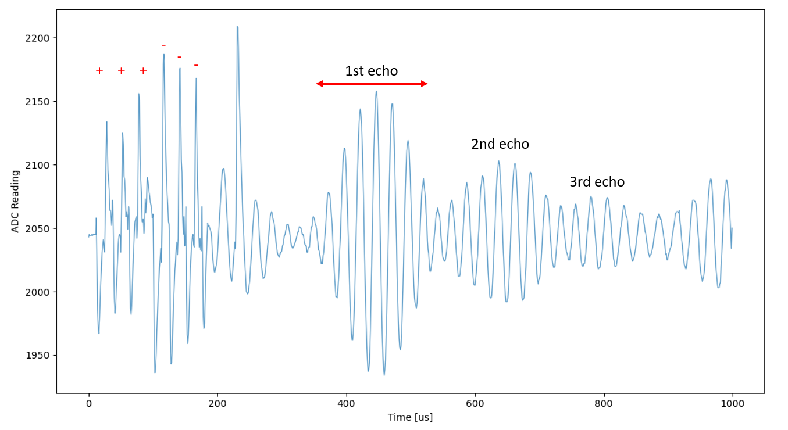

Update: 2021-05-13

The amplitude of the previous mentioned excitation is too low. 
In a test with windspeed above `30mph`, it failed to capture the beam in most of the cases. 
A new excitation is used here:
~~~
#define H 98
#define L 0
#define P H,L
#define N L,H
const uint16_t cpulse[] = {P,P,P,P,P,P,N,N,N,N,P,P,N};
~~~
This pattern have `6` positive phases to increase the amplitude to `1830~2270` (`440`) compared to original `1950~2150` (`200`)
Followed by some negative phases (act as a damping).

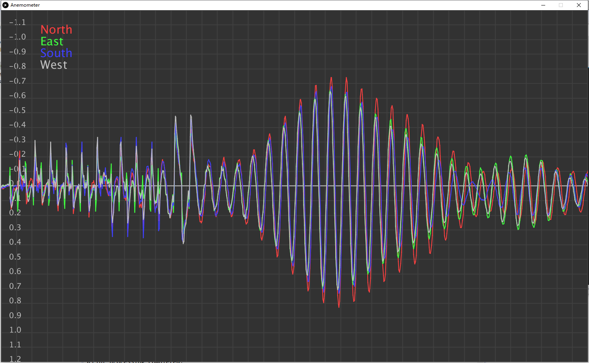

#### Locating the echo - Peak matching

We need to measure the time of the sound beam propagating through the path. 
So that we need to recognize the beam in some ways and measure the time `dt` it within the measurement. 

Here, the `dt` is measure in 2 steps. 
- Peak Matching - measure a rough position of the beam, accuracy is half period, `12.5us`. 
- Zero-Crossing - improve the accuracy to sub-digit (`<1us`)

The method I implemented first is called **Peak Matching**. 
First, we locate the maximum value as the main peak of the beam. 
Then we detect the turning point of a few peaks before and after the main peak.
We store both positive peak and negative peaks (valleys) with their indexes and values. 

In the searching stage, we slide the newly measured peaks with previously collected reference peaks (calibration) and do a set of Mean Square Error (MSE) based on each peak difference.
Then we can use the minimum MSE to match the offset if there is any.
The search range is `9` or `+-4`; as we also count the valleys, the actual ranges is `2` peaks before the maximum and `2` peaks after the maximum.

As you might notice, we only capture a few peaks around the main peak which is the maximum. 
But sometimes the maximum might not be the main peak due to environmental noise or turbulences. 
So simply capture the maximum peak to locate the beam does not work. 

The accuracy of matching the signal can be as high as the resolution of time in the ADC sampling period, i.e. `~1us @ 1Msps`.

This is by now the most unstable part because the inference from the driver affects the detection of the echo.
Result in sometimes this method will fail and the detection offset by one period, `25us`. 

Here show some (`50`) 'faulty' signals; these ADC measurements are recorded during the calm wind but are fail to calculate (they looks good though). 
The maximum peak of the signals is marked. 
You can see there are misaligned peaks even in a perfect calm wind. 

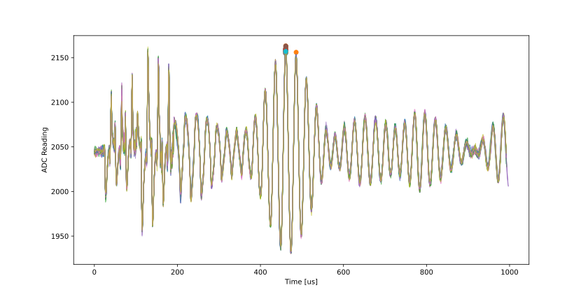

In practice, there are around `1` in `50` misaligned peak measurement in my silence, calm living room and `1` in `5` while next to the TV. 
After the MSE peak matching, most of them can be corrected and can still provide good windspeed. In a 12 hour measurement, 'only' `340` in `43200`, `0.7%` error rate. 
But this is not the end, a further correction is to use the sound speed calculated from the `dt`.
If the sound speed is hugely different from the sound speed estimated from temperature, then this `dt` measurement must be wrong. 
Once a error detected, we make another measurement immediately.  

#### Zero-Crossing detection and interpolation
To further improve the resolution to sub digit of ADC sampling period, i.e. `<1us`, 
we can use an interpolated zero-crossing to utilized both sampling moments and the ADC measurement values.
This method is also suggested by [Lau's blog](https://www.dl1glh.de/ultrasonic-anemometer.html#advancement). 

The resolution of zero-crossing can be extremely high. Below are a few hundred ADC raw measurements. 
You can see that in around zero, the signal looks like a linear function, with a slope rate at around `30`. 
This means in this particular scenarios, after the interpolation, we can produce the resolution `30` times smaller than the original `1us`, i.e. `33ns`.
A steeper slope will bring better resolution, but the accuracy also depends on the signal distribution.  

This method requires a stable zeroing of the raw signal which performed in the first step, preprocessing. 
These offset for each channel were calibrated during the power-up, by measuring and averaging the signal without sending excitation. 
It takes around `1` second. 
Zeroing can also perform during the operation, every hour or every `1 degC` temperature changes to maximize the accuracy. 

Because all `4` channels shared the same amplifier, they also share the minor bias if there is any so that will be cancelled out.
The actual zero offsets of each channel are all at around `2046~2047`, very stable and accurate.
But occasionally, there is some offset in one or all channels as the figure shows below. The east and west channel drifted up. 
This measurement was dumped by the fault detection.(The west also deformed quite much).

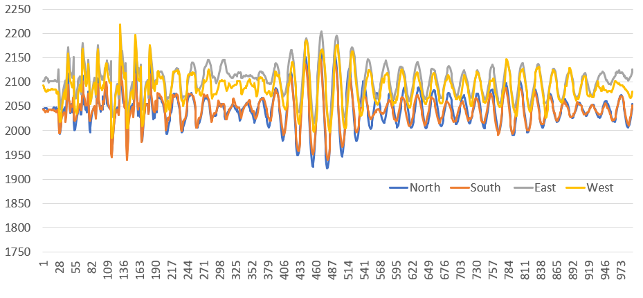

In the starting up, we can collect a set of zero-crossing for calm wind calibration.  
In the later measurement, to avoid the above offset issues, we use a dynamic zeroing method.
Before each measurement start, 
we perform an ADC measurement without excitation to get the real-time zero to eliminate the offset from power sources or others.  

For each channel, we interpolate `6` zero-crossing points around the maximum amplitude of each echo.
As the waves around peaks are the most identical. 
These zero crossings are averaged and produce one number, which represents the location of these crossing. 
There is no need to compare all the zero-crossing moment as I found out their averages are very stable. 

These result in a pretty stable sub-digit accuracy, at least in calm wind. 
A simple test result shows the raw measurements in a standard error at `0.037us`, already very close to the theoretic resolution we calculate. (equivalent to `0.051m/s`).
Better accuracy can be achieved by averaging a few measurements. 
Measurement rate and oversampling can be set through the configuration file same as others. 
This level of accuracy that simple processing can provide is already very promising!

The first wind speed measurement in the north-south direction is shown below.

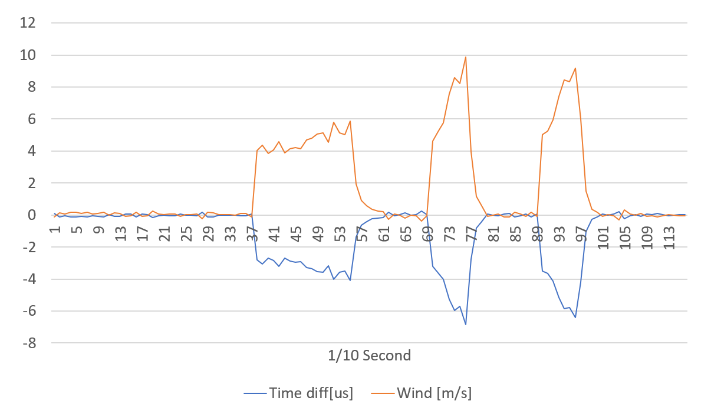

Update: 2021-05-13

The start up ADC zeroing is not needed now. 
Instead of sampling directly, I add ADC sample without excitation that run every timebefore sampling. 
So we can have a dynamic zeroing right before the actual measuring phase. 
Therefore, the offset by temperatures or power can be minimized. 

#### Pulse compression
Pulse compression is very commonly implemented in radar systems, Lau's works are also using it but I am not sure how he uses it. 
If the *peak matching* stability is not enough. I will try to implement a coded excitation using barker-code. 

It is fairly straight forward to perform a matched filter (pulse compression). 
But it requires much more CPU time since it is basically a signal correlation (same as a convolution in machine learning).
If it is needed, quantisation to `8/16bit` fixed-point then use Neural Network acceleration core will help the speed.

In a rough test, for bark-code 4.1 `+++-`, the MCU took `46ms` to compute all `4` channels (correlation of `100 x 1000`).  
The load is ok, but compared to the *peak matching* method, which only takes `6ms`, it is still taking too much time. 
I didn't test a full correlation between 2 channels, e.g. North vs. South, 
which will lead to `1000*1000` maximum, `10` times the complexity of the trial. 
Of course, it is not necessary to make the full correlation, I did test a `300 x 300` windows for both signals. 
It takes around `40ms` per pair of channels. 

I am not sure what is wrong that the side sidelobes are still quite large after the correlation. Not better than the raw signal.
The inverted signal (-) only degrade the peak a little bit, which should be suppressed or inverted. 

- The modulation frequency is too high that the transducer cannot handle. I tried `40kHz` and `20kHz`, not much different. 
- Or the way I process is wrong. 

The major difference between Lau's transducer and my transducer is the packaging materials.
The one I used is aluminium while the one he uses is plastic. 
Another potential issue is the driving voltage, my one only have `10.5Vpp` but Lau's is higher through a transformer(unknown).  

Maybe just leave it by now. 

Update: 2020-05-13

After checking many literatures, I found that it is very difficult to modulate the excitation in high frequency. 
The inertial of transducers delay the phase shifting at least `4` or more cycles depended on the amplitudes. 
I only sussess to code the phase in a `10kHz` (every `4` cycles in carrier frequency (`40kHz`)).
But the signal is too small to stand in a high winds. 

It was very frastrating to try and fail. 
During the time, I have a few email communication with Lau's. 
And thanks for his emails to further explain his setup, I finally understand what was wrong. 
His anemometer has significant more driving capability than the one I built. 
And his transducers has a plastic shell which does have less inertial than the aluminium once I have. 

#### Extracting wind speed and sound speed

Finally, we have stable `4` channels of `dt` measurement ready, together with the mechanical parameters (height and pitch), 
we can calculate the windspeed using the equations that 
[Lau](https://www.dl1glh.de/ultrasonic-anemometer.html#advancement) provided. 

The wind direction can also be inferred from the perpendicular pairs.

Besides, we can also extract the current sound speed directly instead of estimating it from atmospheric pressure and temperature. 

Or in C language
~~~
// wind speed.
ns_v = height / (sin_a * cos_a) * (1.0f/dt[NORTH] - 1.0f/dt[SOUTH]);
ew_v = height / (sin_a * cos_a) * (1.0f/dt[EAST] - 1.0f/dt[WEST]);
v = sqrtf(ns_v*ns_v + ew_v*ew_v);

// sound speed
ns_c = height / sin_a * (1.0f/dt[NORTH] + 1.0f/dt[SOUTH]);
ew_c = height / sin_a * (1.0f/dt[EAST] + 1.0f/dt[WEST]);
c = (ns_c + ew_c)/2;

// course
course = atan2f(-ew_v, -ns_v)/3.1415926*180 + 180; 
~~~

An overnight calm wind measurement shows the measurement and temperature estimation are quite matching.
The temperature range for the below measurement is `20.4DegC` to `25.6DegC`.

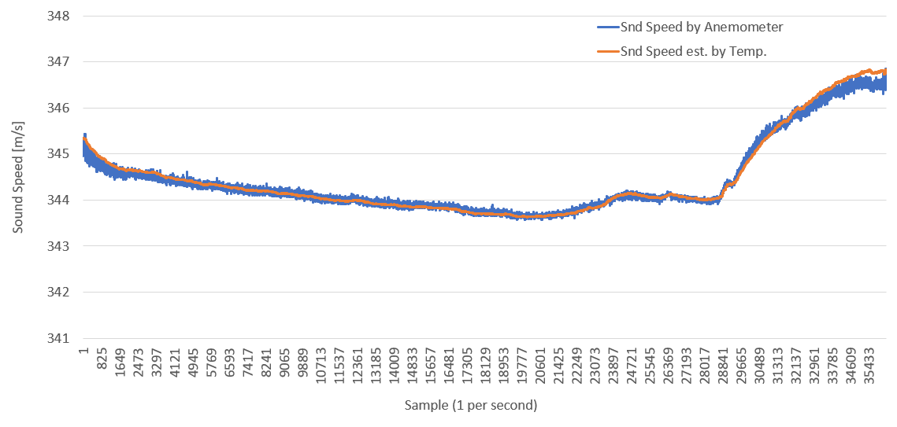

#### Fault detection and correction

There are many interference sources from both environmental noise or other onboard electronics. 
Sometimes cause the deform of the signal as I already mentioned in the previous sections. 
There are indeed other hidden sources that I could not find. 

Due to the low-power requirement, I did not implement any filter to detect the final results based on previous measurements. 
Because the difference in wind speed can be huge if the device needs to sleep for as long as `30` seconds.

**Misaligned Beam**

In the case of misaligned beam detection, I mentioned in *peak matching*, 
I also calculate the history of MSE error and it is updated at a small rate at every MSE calculation. 
A hard threshold is added to the history MSE to set a final MSE threshold. 
This method effectively filters out around `9/10` of the misaligned cases which cannot be recovered by a simple minimum MSE.
A demo is shown below. A dynamic MSE and final threshold. 

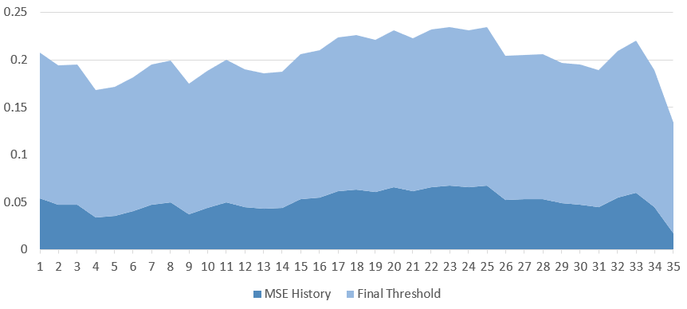

**Sound speed safeguard**

There is a final safeguard that can be used to detect the errors, that is, the sound speed calculated from the `dt`. 
The sound speed measurement is pretty stable and can be estimated from the temperature measured by other sensors. 
The difference between wind speed estimated by temperature and estimated by `dt` is normally smaller than `2<m/s`. 
The difference threshold is set to `5m/s`.

If any of the above error is detected in any channel, the current measurement will be dropped and a new measurement will be performed immediately. 

#### Debugging

To help to debug, once a fault detected, the `4` channels ADC measurement will be recorded into SD card. 
Actually, most of the faulty figures shown in the above sections are plotted from those dumping data. 

I also wrote some Python scripts to post-process the data or and some Processing3 scripts to show real-time data. 
They are extremely helpful. Here is a screen recording of the Processing3 scripts plotting `4` channels of real-time data. 

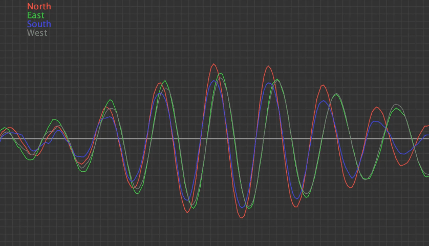

Overall, I would like to repeat what Lau has said in his blog “building the anemometer is definitely not as easy as I thought.” 

#### Timing

For each channel, the measurement will start with switching analog signals paths and enable the dedicated driver.
Then we wait for `4ms`  to let the signal path stable and let the driver charges to its boosting voltage (`<150us`).

We perform an `idle` measurement (no excitation) to get the zero of ADC measurement, which takes `1ms`.  

Then the coded pulses are sent to Timer via a DMA channel to generate ultrasonic waves. 
At the same time, the timer also triggers the ADC to start sampling. 
Another DMA channel is responsible to collect all measurement. 
This takes another `1ms` to finish.  

In total, sampling all channels take `~25ms`.

Once all `4` channels of data are ready, then all data processings mentioned in the above sections are performed. 
The whole processing takes `19`ms. So, each measurement takes `19+25=44ms`.

The measurement and processing time is shorter than I expected. 
Thanks to the *peak matching* method which is relatively less computational expensive compared to the correlation method. 

Overall, I really satisfied with the processing time as less than `50ms` allowing the MCU and analog circuit to sleep more to save power. 
It also left more space once a fault is detected, we still have plenty of time to take a few more samples to achieve a correct measurement. 
Or, when power consumption is not a case, can oversampling up to `20` times in a second for better accuracy. 

#### Processing summary

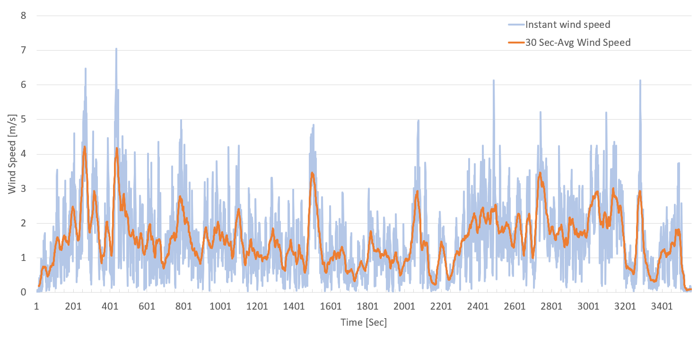

By using the above processing, the Anemometer can now produce a quite stable measurement. 
The above `1` hour measurement was done in one of the windy, sunny afternoon without a single none recoverable fault.

The major difficulties are:
- Selecting and generating a good pulse. 
- Locating the beam is difficult in both calibration and real-time measurement. 
- Fault detection. Decide when to fixed a signal and when to redo the measurement.  

These parts are where most of my effort was put into. 

But once the process was finalised, the single firmware worked easily in all `4` different hardware I built. 

### Keep out zone
During the development, I found any object if existed in this zone will affect the shape of the sound beam, 
therefore affect or fail the windspeed measurement.

- Objects in Zone 1 will fail all measurement.
- Objects in Zone 2 will fail calibrations, but the above algorithm can still produce stable measurement.

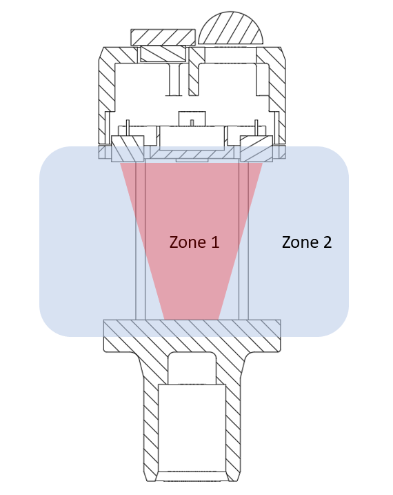

It is likely that when a bird sit on the reflective plate fail the measurement completely. 

## Experiments

### Car test

I brought a `88mm` magnet car roof mount to mount the QingStation on the roof of the car. 
I used a few 3D printed parts and a `38 x 2.2CM` PVC tube to raise it up a little bit.
So the air flow compressed the car won't affect too much. 
The actual height from the car roof to the top of QingStation is `55CM`. 
The car is `1410mm` height, so the total height is just less than `2m`. 

First test:
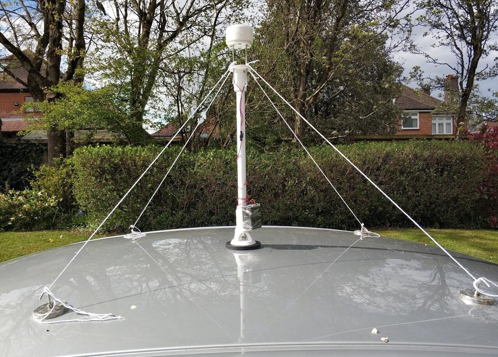

Second test:

Comparison of GNSS speed and Windspeed measurement.

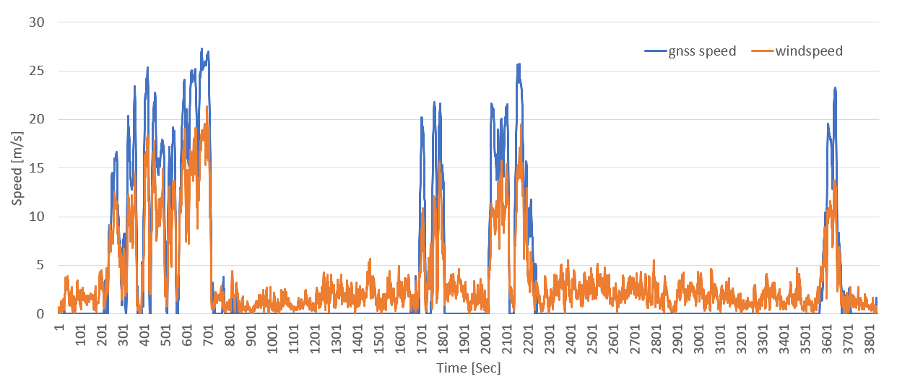

The windspeed measurement is higher than the GNSS speed. 

- It might because the location is still in the compressed bubble of the car, where the air speed is being compressed and increased.
- Or it might be something wrong with the calculation. 
- Or it might be the air flow from the car ahead of me.
- Or wind. 

Here is the windspeed measurement and `30sec` average. A `30sec` average makes more sense.

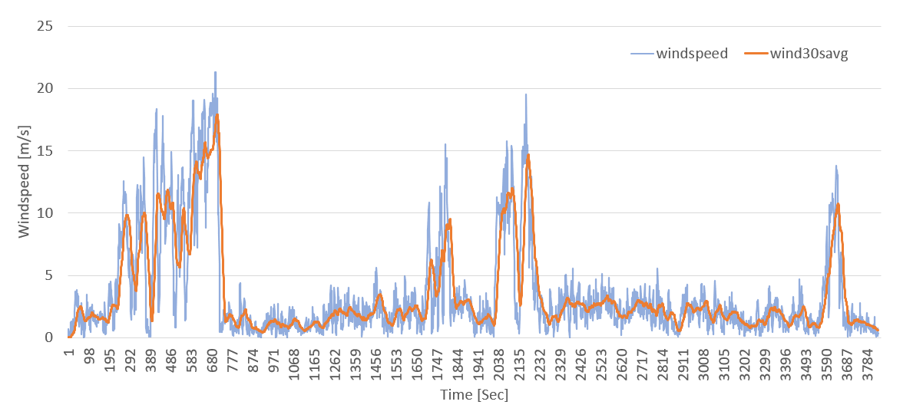

Most of the time, we just stopped by 5 or 6 passing trains in the middle of the road. Fortunately, we were the first car in the queue so I do enjoy the time watching them. 

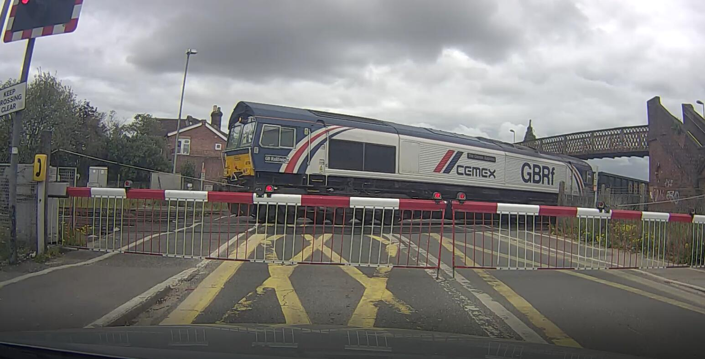

### Motorway test

I printed a much shorter stick to lower the center of gravity. 
The plan was to test the anemometer in a high wind speed, because it was never done.

I only have the rain sensor lens attached to the vented top, so I install that one. 
And... it didn't take long to reach a heavy rain. 

Unfortunately, the SD card failed at the very beginning hitting the rain. 
The QingStation kept sending MQTT messages for another hour in the heavy rain until we reached the destination (Durdle Door).
- The Anemometer failed after `~30min` in the rain. 
- All digital sensors down when the circuit was wet. 
- The Barometer failed for a few minutes then came back up.
- The Battery voltage dropped dramatically to `3.1V` for some minutes when the connector got wet. 
- RTC clock stopped (crystal got wet). 
Not sure if there are electrochemical reaction or the ADC pins got wet (maybe that is also the reason that Anemometer failed.). 
- The SD card has a few random files/folders written. Data files are all fine but logging files are wrong. 
- Logging was failed and the MQTT messages are not saved so I have no idea what was wrong. 

Once everything is dry, they are all back and working well. 

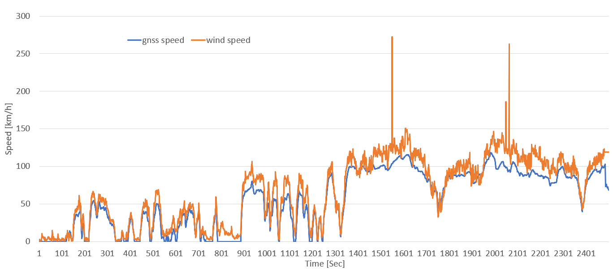

The log shows perfect tracking of windspeed below `~72km/h` (`20m/s`), but it started to fail sometime at `108km/h` (`30m/s`).
This is also shown in the error codes (not listed). Anemometer started to struggle a bit at high speed (`30m/s`), reporting errors almost every `3` sec. But it still can provide a good measurement within `1` second recording period. But there were `3` failures that report even `200km/h`. 

I think the results are acceptable, since `>20m/s` wind doesn't occur all the time. 

Due to the mounting point is lower, the air acceleration effect is larger than the previous low speed test. I think it is in a normal range. But since I don't have access to wind tunnel to calibrate the sensor. There is not much I can do. 

