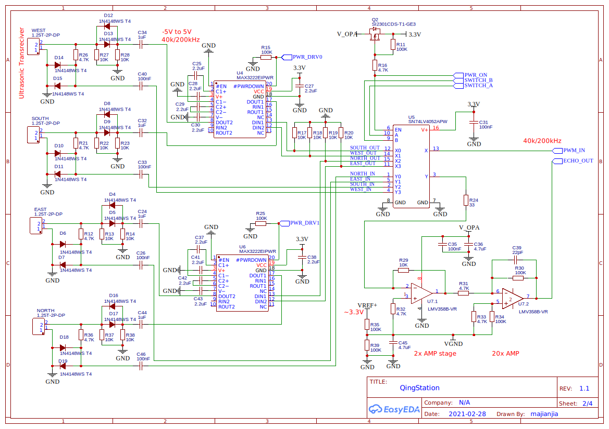

# Anemometer Desgin and Practice

This documentation is dedicated for the ultrasonic anemometer design and tuning. 

# Introduction
Anemometer is the most interesting sensor on QingStation. 
However, it is also very challenge for me since I got almost no experience 
(I dont event know how to use OPA AMP at the beginning).

A very good blog I learnt from time to time is this one [Anemometer by Hardy Lau](https://www.dl1glh.de/ultrasonic-anemometer.html#advancement) 
This log is very informative and already cover the most of the knowlege needed to build your own ultrasonic anemometer. 

The principle in short: the wind speed is by measured by the time that the ultrasonic waves (pules) propogate forward and backward 
between a pair of transducers. 
With 2 pairs of transducer placed perpendicular in horizontal, the wind direction can also be calculated by using trigonometry.

The advantage of ultrasonic anemometer compared to others types
- The spinning type (cup anemometer) is much larger.
- Resonable easy and cheap to DIY, good instruction by Hardy. 
- No moving parts! Moving part are not very easy to DIY expecially when water proofing. 

# Methods

## Basic Principle

## Practical Issues, Solution and Compromise
In reality, things normally dont work as we want, expecially with analog circuit. 

Here is the schmatic of the second version(v1.1), details will be explained in the following sections.

### Ultrasonic Transducer, Driver 

Driver design, chips selection. 

### Echo Amplifier

Echo signal strength. OPA. Noise. 

### Signal Processing

#### ADC Setting 

STM32 ADC.

#### Preprocess
ADC to Float. Filter. Zeroing. 

#### Echo Pulse

#### Pulse Compression
See if needed. take times to calculate. 

#### Zero-Crossing Detection

#### Extracting Wind Speed

## Calibration

