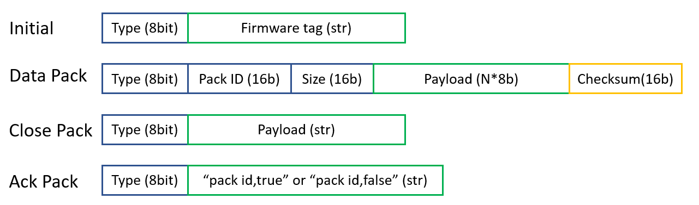
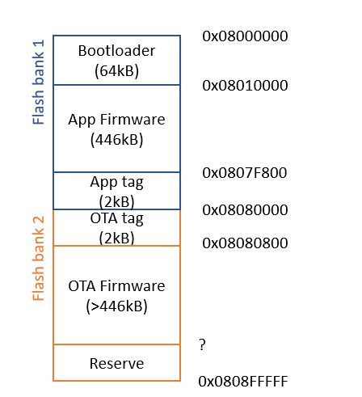

# Over-the-Air (OTA) Firmware Upgrade

Over the air firmware upgrading give QingStation a huge flexibility in a unmanned field application, 
For example, when the QingStation is installed on the roof of a building, 
it is really annoying to dismount everything and just to download an upgraded firmware.

Supporting OTA means we can just sit in front of the PC and upgrade the firmware remotely, what a huge improvement! 

## Methods

Since we already support MQTT to publish the weather data, we can make a minor modification to the existing MQTT to transfer firmware.

- Add a subscription to topic `ota_downstream` to receive data.
- Publish to topic `ota_upstream` to send acknowledge.

On the PC side, a python script will perform the firmware segmenting and packaging. 
The MQTT client used here is Paho-MQTT. 

The script will split the the firmware to a size of `256 byte` package. 
An package ID and checksum will be added and put into MQTT message payload.

After every data package is sent, the script wait for an Ack package sent from QingStation. 
If validation is correct, it will send the next package, if not, it will resend the last one. 

### Message

This is the messages protocol that exchanges between QingStation and the python script. 
You can see that it is very simplified. 
- No Authorization. 
- No validation for payload expects the data package.
- No handshake.
- Dose not support resume from break point.

All of them are to simplify the implementation. 

### Flash Space Allocation

The MCU we used `STM32L476RG` has `2` independent flash banks that can be read or written at the same time.
The main applications is running on the `bank 1`, so we just use `bank 2` to store the OTA firmware. (No need to store in SD card)
After the transmission is finished, we can then use our bootloader to copy the OTA firmware to `bank 1`.

Here is the memory allocation for the current setup. 

### Firmware TAG

In the above diagram, you might notice there are some sections call `xxx tag`.
That is where the description of the firmware. It is stored in a readable string format separated by comma. 
The most important parts are:
- MD5 checksum
- Firmware size
- package size
- version

### Finishing the update

Once all the firmware is transferred completed, application destroys its own tag to mark the firmware invalid. 
Then it makes an software reset and handover to the bootloader.

The bootloader will read the tags especially the MD5 checksum.
It will perform a MD5 checksum through the Application and OTA space, and it will compare the MD5 with those tag. 

Once the bootloader checks and finds out that application space is invalid and OTA is valid, it will copy the firmware from OTA space to Application space. 
Or when both firmware are good and but OTA version > application version, it will also perform an update. (copy OTA to application).

## Performance

I did a test with the below setting:
When using ESP8266 as the WIFI module and the broker from AWS located in the UK. 
- The uploading speed is `850Bytes/sec` when using `QS0` MQTT subscription and `530Bytes/sec` for `QS2`.

Not great but still faster than go to the roof and disassembling everything.

PS: the bootloader also support update from SD card. See dedicated document for detail (not ready).

