# Rain Sensor

This document records the development of the optical rain sensor on QingStation.

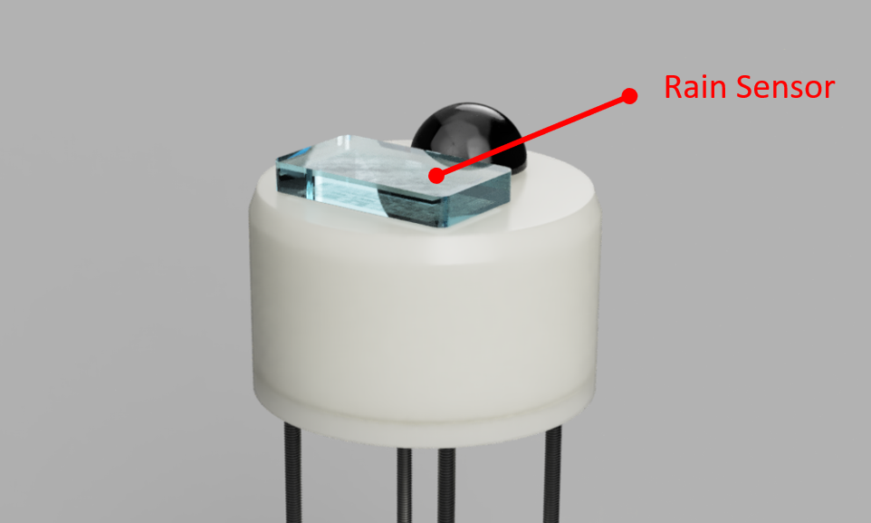

## Principle

Here we are building a Infrared Optical Rain Sensor, which is common in today's car automotive windshield wiper. 
The below diagram from wiki shows the principle of these type of rain sensor.

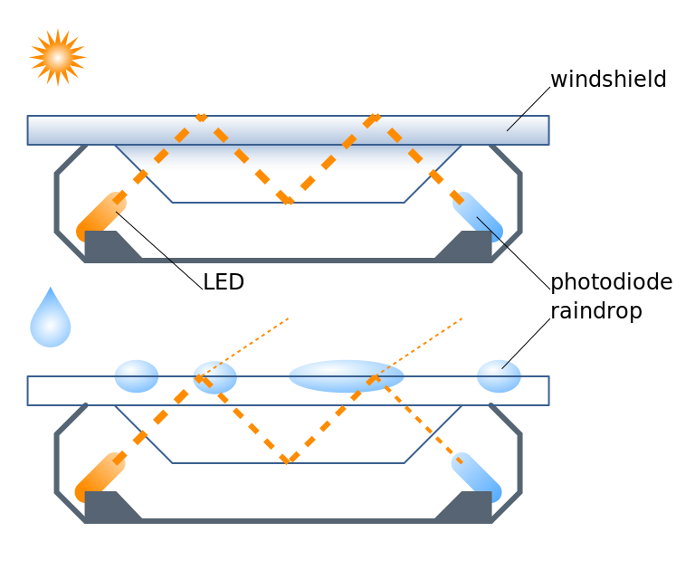

When the glass is dry, the IR travels through will be totally reflected between top and bottom of the `2` pieces of glasses. 
When there are rain drops on the glass, the IR light will not be totally reflected, so the light intensity will decrease. 
We can then use a photodiode to measure the intensity of light to read the rain. 

There a few strategies can convert the measurement to rain level. 
- Count how many drops (changes of measurement) in a time period. 
- Calculate the variance of continuous measurement. 

Since our sensor is small, it is expected that the "accuracy" will be low especially in small rain. 

## Design and Practice

The optical lens is the most difficult part for the rain sensor. 
I did not even try to use real glasses.
The materials I selected is polycarbonate (PC), a clear and UV resistance plastic materials. 
It has better physical mechanical properties than acrylic, but only a bit more expensive. 

The optical part is consist of `2` pieces of PC sheet glued together. 
The top one is flat with right angle on all the side. 
The bottom one is smaller with 2 short sides in a `45` degree angle. 
2 PC sheets are glued together by clear epoxy.

## Lens Assembly

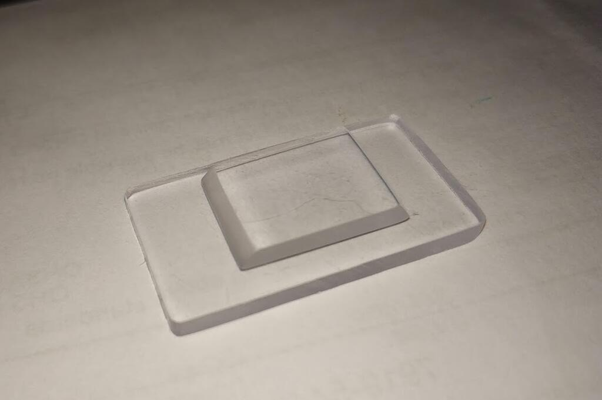

There are a few bubbles in between the glued surfaces, because of a mistake during the epoxy curing. 
The epoxy I brought was a very low viscosity, and it take ages to cure (~2days).
So I add a little bit of heat to it (placed it on top of my PC's power unit.) 
When I check it a few hours later, the bubbles appeared.  

Anyway, as long as it works, that is fine.

## Photodiodes and measurement. 

Measure schematic is shown below. 
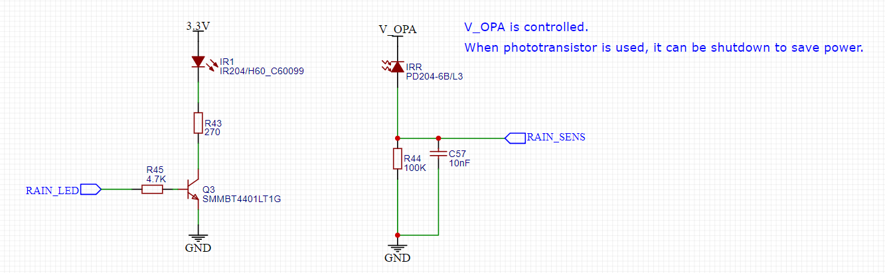

As you can see, it is very simple. A infrared LED driver and a photodiode receiver. 

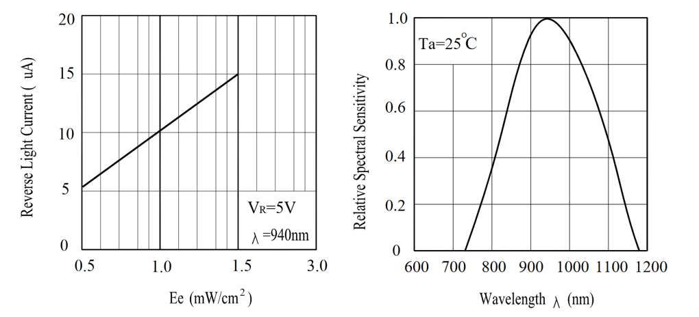

A typical photodiode (e.g. PD204) has a reverse current at around `5~15uA`. 
So a serial `100k` resistor is capable to provide `0.5~1.5V` dynamic ranges for ADC to measure.
There is also a buffer capacitor for ADC to provide more stable voltage measurement. 

After assembly and testing, with this setup, a `3ms` short pulse is enough for producing a stable voltage. 
With a `5ms` LED pulse, the ADC measurement are around `1000` in indoor.

However, when outdoor with good sunlight, the measurement can go all the way up to `4000`, already close the the maximum range `4095`.
I think it is better to change the resistor to `47k` to compensate the sunlight effect with this unnamed F3 diode. 
Apparently, the diode I used has larger reverse current than the one I shown above. 
Later I changed it back to `PD204/B`

I set the measurement frequency to `10` times per second, and use `10` seconds windows to calculate the variance.
Since there is no a physical unit so I use the raw ADC data to calculate the variance.  
That is, the variance is based on `100` ADC samples. 

## Experiments

### "Calibration"

I tried to use shower to figure out the variance ranges in different rain levels. 

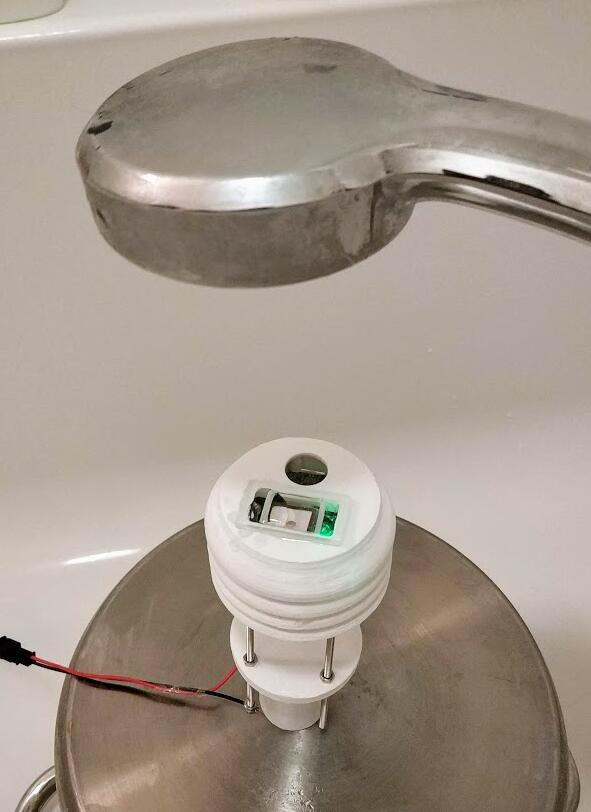

Here is the data.
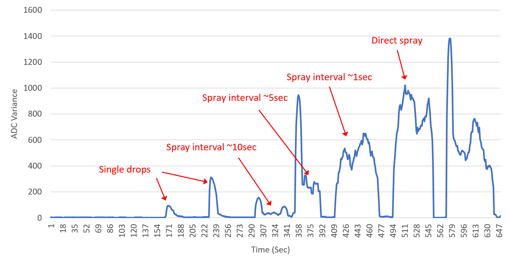

The variance dose increase as more droplets lands one the sensor. 

The range I summarized is here:
- Light rain: `>15`
- Moderate rain: `>70`
- Heavy rain: `>200`
- Violent rain: `>500`

### Rain test

Very luckily, there a rain is coming in the night of the calibration. 

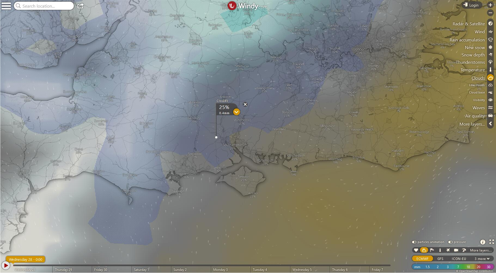

The QingStation stay in balcony for the whole night.
Battery and charger are sealed in a zip bag.

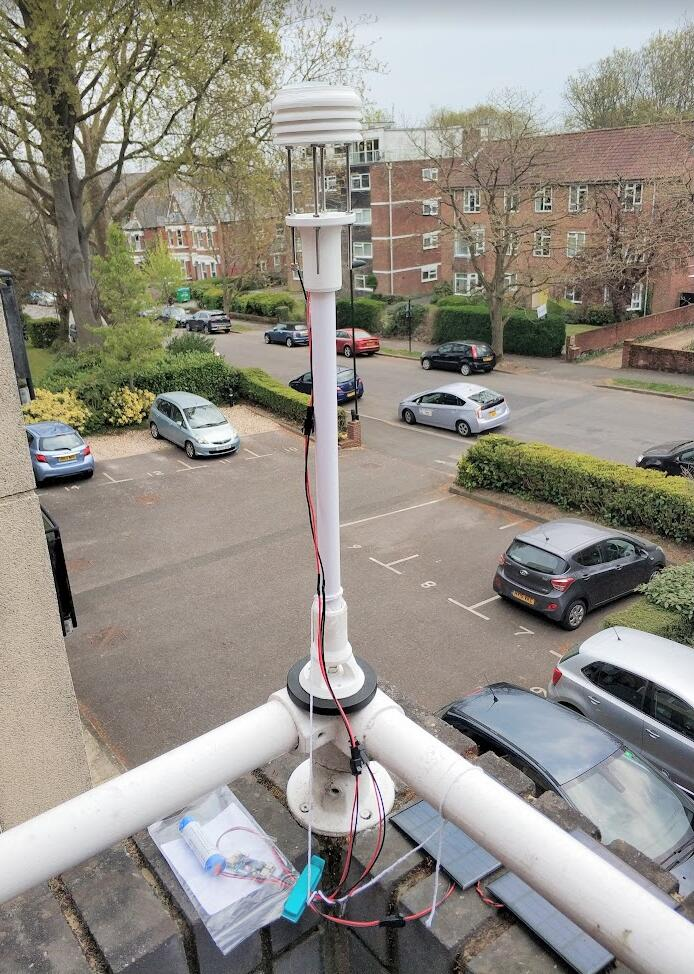

Solar panels. 
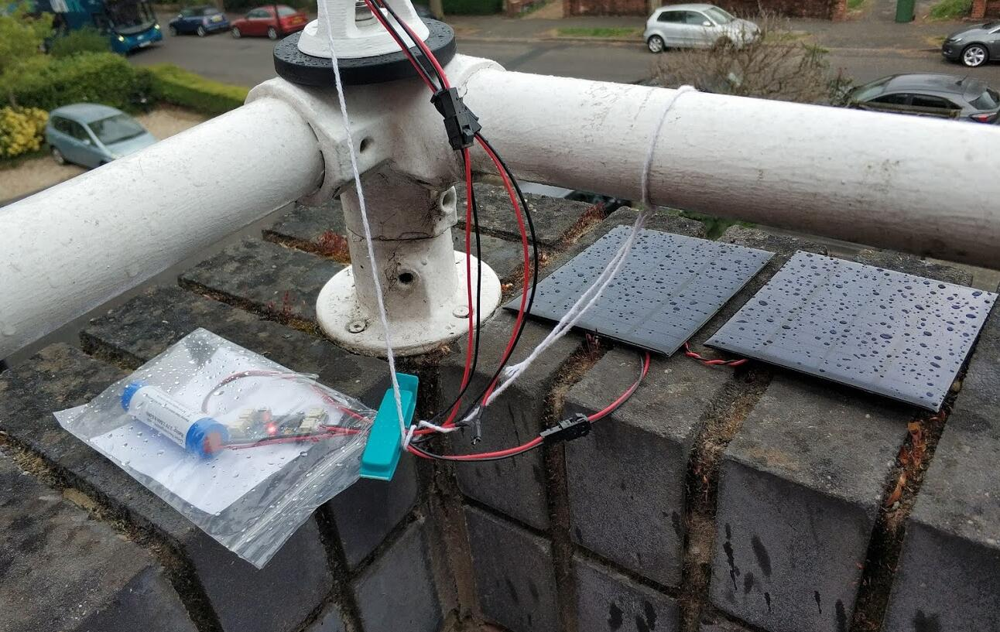

Rain sensor lens.
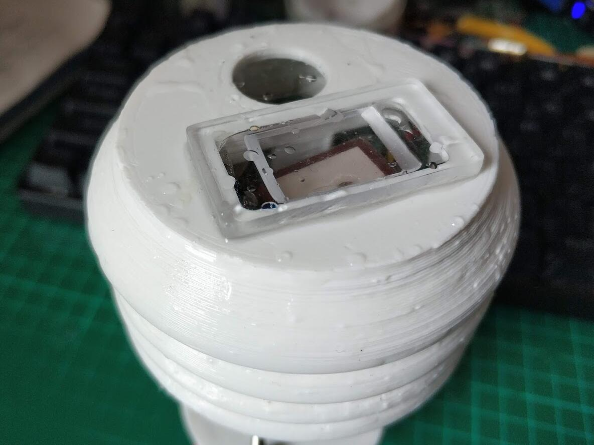

The data of the overnight measurement is shown below. 
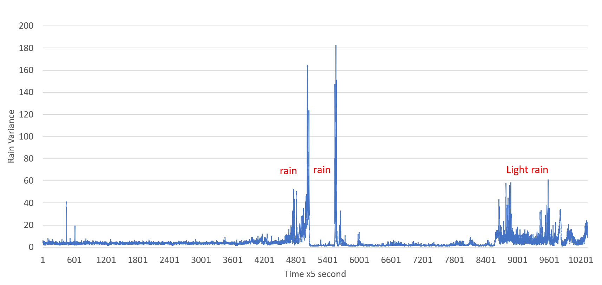

I only able to capture the raining in final bit (near noon time).
When the middle `2` peaks are measured, I didn't wake up. 
The battery ran out in the afternoon since there is no enough direct sunlight.

A few findings here:
- The sunlight has some affect to the variance. 
- The calibration seems working well. `10~70` corresponds the light rain which is same as I observed. 
- The measuring area is small, so it need a longer period for a droplet to land near it.
- This device cannot measure rainfall in mm, since it cannot detect the size of the droplet only the frequency. 

